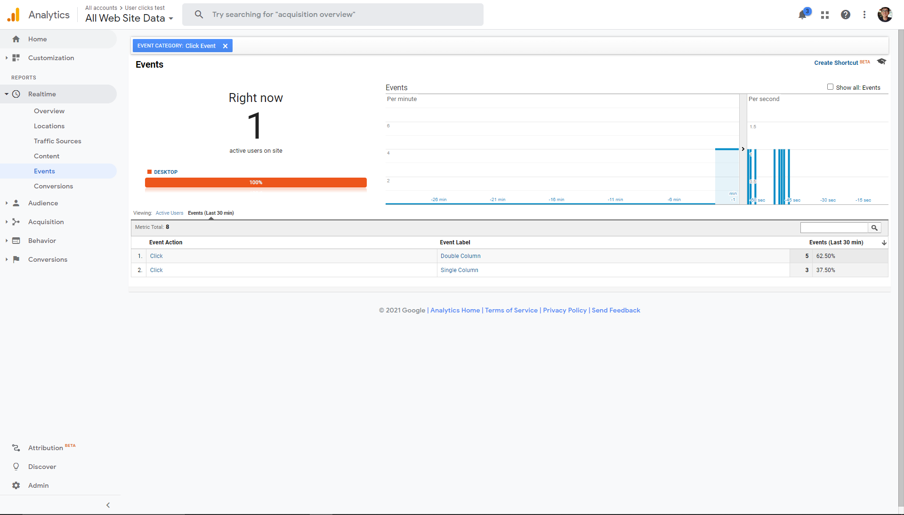

# Lab 10

## Part 1
Link to [canny.io page](https://cse110-lab10-will-chung.canny.io/).

## Part 2
Link to [first split](https://will-chung.github.io/Lab10/index.html).

Link to [second split](https://will-chung.github.io/Lab10/secondSplit.html).

For the second split, when you open `secondSplit.html` with a liveserver and hit refresh several times, you should be getting a dark mode styling 50% of the time, and a light mode styling 50% of the time.

## Part 3

